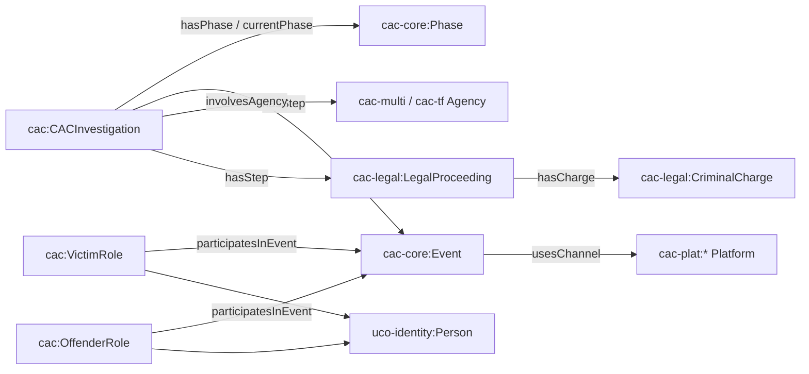
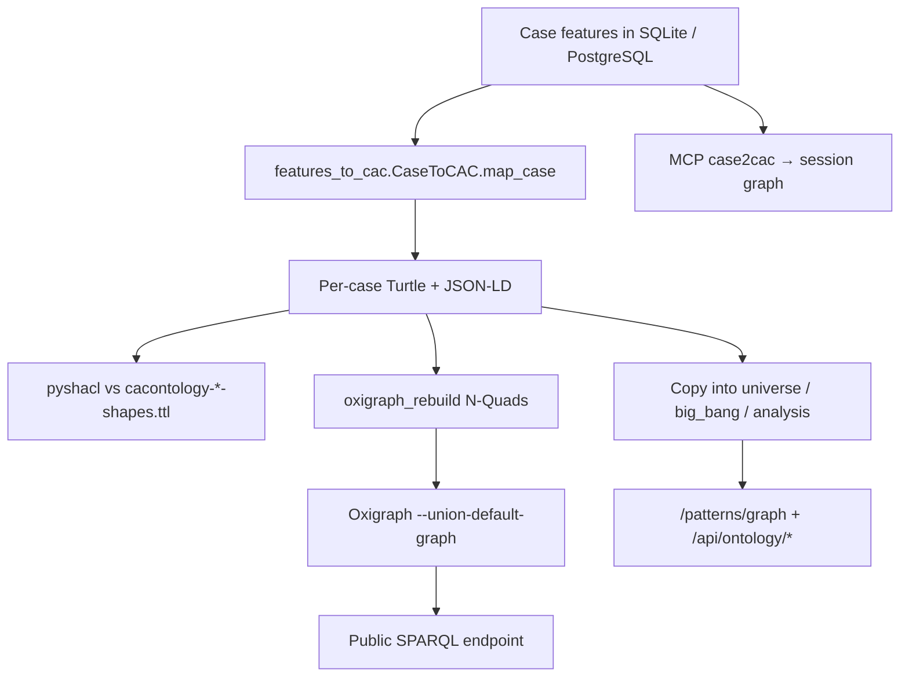

# CaseLinker Ontology

CaseLinker maps each extracted case into a **CASE / UCO / CAC** knowledge graph: typed investigations, events, platforms, agencies, victim and offender roles, charges, and outcomes. The live store is public SPARQL. This directory is the mapping code, the graphs, the research evidence, and the docs.

| | |
|---|---|
| Live SPARQL | [`https://caselinker.up.railway.app/sparql`](https://caselinker.up.railway.app/sparql) |
| Protocol, limits, errors, example queries | **[docs/SPARQL.md](docs/SPARQL.md)** |
| OpenAPI | [`/docs`](https://caselinker.up.railway.app/docs) (`GET\|POST /sparql`) |
| Graph explorer | [`/patterns/graph`](https://caselinker.up.railway.app/patterns/graph) |
| SDK MCP consumer | [CASE/UCO SDK v1.25.0](https://github.com/vulnmaster/CASE-UCO-SDK/releases/tag/v1.25.0) `execute_sparql_query` |
| Mapping spec | [MAPPING_PLAN.md](MAPPING_PLAN.md) |
| Mapper | [features_to_cac.py](features_to_cac.py) |

The repo README keeps the one-page method summary. This file is the working documentation for the graphs.

## Vocabulary

The [CAC Ontology](https://github.com/Project-VIC-International/CAC-Ontology) (Crimes Against Children, Project VIC) is the investigation vocabulary. It sits on the Linux Foundation [Cyber Domain Ontology](https://cyberdomainontology.org/) stack: [UCO](https://unifiedcyberontology.org/) (identity, role, core) and [CASE](https://caseontology.org/). CaseLinker does not invent predicates; it binds extracted features to CAC classes and UCO types so the same SPARQL and SHACL tools used in forensic workflows apply here.

Pinned copies of core / grooming / platforms / sextortion modules and their SHACL shapes live in this folder (`cacontology-*.ttl`). Bindings and class lookup: [CASE/UCO SDK](https://github.com/vulnmaster/CASE-UCO-SDK) with `CASE_UCO_EXTENSIONS=cac`.

**Prefixes used in instance graphs** (full list and SPARQL preamble: [docs/SPARQL.md](docs/SPARQL.md#namespaces)):

```
cac:          https://cacontology.projectvic.org#
cac-core:     https://cacontology.projectvic.org/core#
cac-plat:     https://cacontology.projectvic.org/platforms#
cac-legal:    https://cacontology.projectvic.org/legal-outcomes#
uco-identity: https://ontology.unifiedcyberontology.org/uco/identity/
uco-role:     https://ontology.unifiedcyberontology.org/uco/role/
```

Instance IRIs are `https://caselinker.up.railway.app/resource/{case|platform|agency}/…`. Each case is also a **named graph** at `…/resource/case/{case_id}`. `dcterms:identifier` on `cac:CACInvestigation` is the CaseLinker case id.

## What a case graph contains



Typical triples: investigation metadata (`dcterms:source`, `dcterms:created`), current prosecution phase, offense events (`cac:hasStep`), platform channels (`cac:usesChannel`), victim/offender roles on UCO `Person` nodes, and legal outcomes when the press release supports them. Mapping rules and unmappable gaps: [MAPPING_PLAN.md](MAPPING_PLAN.md).

Example files: [`graph_output/nj_ag_2017_001.ttl`](graph_output/nj_ag_2017_001.ttl) (Turtle) and the matching `.jsonld`.

## Pipeline



1. **Features** — already extracted (platforms, topics, investigation signals, prosecution outcomes).
2. **Map** — [`features_to_cac.py`](features_to_cac.py) (`CaseToCAC.map_case`). Batch wrapper: [`graph_generate.py`](graph_generate.py).
3. **Emit** — `{case_id}.ttl` + `{case_id}.jsonld` under [`graph_output/`](graph_output/).
4. **Validate** — SHACL; non-conformant graphs are reported (`validate()` / `validate_shacl=True`).
5. **Serve** — wholesale Oxigraph reload ([`oxigraph_rebuild.py`](oxigraph_rebuild.py), [`scripts/rebuild_oxigraph.py`](../scripts/rebuild_oxigraph.py)). Query policy (LIMIT / Update / SERVICE): [`run/sparql_proxy.py`](../run/sparql_proxy.py). HTTP route: [`run/main.py`](../run/main.py) `GET|POST /sparql`.

Rebuild is remap-and-overwrite, not incremental. Platform/agency extra facts can vary by batch order ([issue #10](https://github.com/mrinaalr/CaseLinker/issues/10)).

How to query the live store, including GET vs POST, `VALUES` + `LIMIT` ordering, and error codes: **[docs/SPARQL.md](docs/SPARQL.md)**.

## Graph pools

Live SPARQL loads **every** canonical per-case graph (**7,426** `cac:CACInvestigation` as of the current rebuild). Patterns / MCP use smaller locked subsets. Display membership is the txt files — do not edit the counts by hand.

| Pool | ID list | Folder | Used by |
|---|---|---|---|
| Full mapped corpus | all sqlite IDs | `graph_output/*.ttl` (staging) | Oxigraph / SPARQL |
| Universe | [`universe_ids.txt`](universe_ids.txt) (1,969) | `graph_output/universe/` | `/patterns/graph` Universe |
| Big Bang | [`big_bang_ids.txt`](big_bang_ids.txt) (968) | `graph_output/big_bang/` | `/patterns/graph` Big Bang |
| Analysis | [`analysis_ids.txt`](analysis_ids.txt) (124) | `graph_output/analysis/` | MCP / research cohorts |
| Compare | [`selected_200_ids.txt`](selected_200_ids.txt) (200) | subset of universe | `/patterns/graph` compare chips |

Canonical TTL for Oxigraph: **universe > staging > big_bang > analysis** (first match wins). Merged viz JSON: [`merge_graph_cache.py`](merge_graph_cache.py) (`GET /api/ontology/merged?pool=…`).

Static files are public: `/ontology/graph_output/{pool}/{case_id}.ttl|.jsonld`.

## Code map

| Path | Role |
|---|---|
| [`features_to_cac.py`](features_to_cac.py) | Feature dict → rdflib graph; SHACL validate; CLI for one case |
| [`graph_generate.py`](graph_generate.py) | Batch generate TTL/JSON-LD |
| [`graph_utils.py`](graph_utils.py) | Shared RDF helpers |
| [`oxigraph_rebuild.py`](oxigraph_rebuild.py) | Canonical TTL → named-graph N-Quads |
| [`merge_graph_cache.py`](merge_graph_cache.py) | Merged node lists for Patterns |
| [`select_cases.py`](select_cases.py) | Stratified / compare-set selection |
| [`big_bang.py`](big_bang.py) / [`eval_big_bang_graphs.py`](eval_big_bang_graphs.py) | Bridge-dense subset + SHACL eval |
| [`noise_filter.py`](noise_filter.py) | Noise / false-positive filter used by mapping |
| [`q1/`](q1/) [`q2/`](q2/) [`q3/`](q3/) | Research evidence (see below) |
| [`PACER/`](PACER/) | PACER docket → lifecycle facts (feeds `/lifecycle`) |
| [`docs/SPARQL.md`](docs/SPARQL.md) | Public SPARQL 1.1 API |
| [`MAPPING_PLAN.md`](MAPPING_PLAN.md) | Class-by-class mapping spec |

## Research questions (Q1–Q3)

The graphs exist so these questions can be asked at corpus scale, not only in SQL.

| | Question | Evidence |
|---|---|---|
| **Q1** | What about a platform (affordance / surface / harm) made exploitation possible? | [`q1/`](q1/) — [`q1_evidence.json`](q1/q1_evidence.json), [`q1_affordance_table.md`](q1/q1_affordance_table.md) |
| **Q2** | What does offending and enforcement look like across offense subsets? | [`q2/`](q2/) — [`q2_lifecycle.json`](q2/q2_lifecycle.json), [`q2_lifecycle_table.md`](q2/q2_lifecycle_table.md) |
| **Q3** | Where can technology or enforcement intervene? | [`q3/`](q3/) — [`q3_interventions.json`](q3/q3_interventions.json), [`q3_intervention_table.md`](q3/q3_intervention_table.md) |

Rebuild tables: `python3 ontology/q1/q1_evidence.py` (same pattern for q2/q3). Narrative pages: `/patterns/questions/q01`–`q03`.

## PACER and lifecycle

[`PACER/`](PACER/) pulls public federal docket material into structured records (`corpus2pacer.py`, `cases2records.py`, `build_facts_graphs.py`) for five offense families (enterprise, enticement, production, sextortion, trafficking). Those graphs feed the CAC state machines under `state_machines/` and the `/lifecycle` UI. They are a **lifecycle overlay**, not the 7,426-case SPARQL corpus.

## MCP (on-demand cohorts)

CaseLinker’s own MCP does not execute SPARQL. It builds **session** CAC graphs from case IDs:

`filter_cases_by_tags` / `get_cohort_members` → `case2cac` → `graph_summarize` / `graph_compare_cohorts` → `export_case_graph_ttl` (optional write into `graph_output/analysis/`).

See [`caselinker_mcp/README.md`](../caselinker_mcp/README.md). To run SPARQL against the **published** store, use curl or the CASE/UCO SDK tool `execute_sparql_query` ([docs/SPARQL.md](docs/SPARQL.md)).

## Regenerate locally

```bash
# Map all DB ids → graph_output/*.ttl + *.jsonld (SHACL on)
python3 -c "from ontology.graph_generate import generate_graphs; ..."  # or use features_to_cac CLI

# Reload production Oxigraph (wholesale PUT /store)
python3 scripts/rebuild_oxigraph.py
```

One-off: `python3 ontology/features_to_cac.py <case_id>`. Live SPARQL tests: `CASELINKER_SPARQL_LIVE=1 pytest tests/test_sparql_live.py -q`. Proxy unit tests: `pytest tests/test_sparql_proxy.py tests/test_oxigraph_rebuild.py -q`.

## External references

- [CAC Ontology](https://github.com/Project-VIC-International/CAC-Ontology)
- [CASE](https://github.com/casework/CASE) · [UCO](https://github.com/ucoProject/UCO) · [Project VIC](https://projectvic.org/)
- [CASE/UCO SDK](https://github.com/vulnmaster/CASE-UCO-SDK) (v1.25.0 SPARQL MCP)
- [Oxigraph](https://github.com/oxigraph/oxigraph) (SPARQL 1.1 store)
