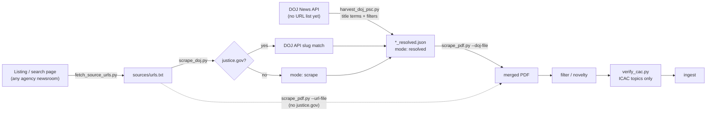

# Press-release scraping suite

This directory turns **any public press release** — a URL list or a DOJ News API harvest — into a structured **PDF** for CaseLinker. ICAC/CAC filters are optional gates, not the engine. Onboarding is this file; extractors and DOJ API quirks are `PRESS_RELEASE_SCRAPING.md`; the ICAC expansion queue is `EXPAND_SOURCES.md`.

## The pipeline, in one picture



The suite is **press-release → PDF**, not ICAC-only. Topic filters (`verify_cac.py`, PSC body regex, “child sexual” listing queries) are **optional gates** for the ICAC corpus. `scrape_pdf.py` will turn any public article URL — or any DOJ API resolved record — into the same `Title / Publication date / Source: https:// / body` layout.

Two things to notice:

1. **Discovery and PDF conversion are separate.** Empty/wrong inputs produce empty/wrong PDFs. HTML listings go through `fetch_source_urls.py`. DOJ **discovery** (you do not already have URLs) goes through `harvest_doj_psc.py`. DOJ **resolution** of URLs you already have goes through `scrape_doj.py`.
2. **`scrape_doj.py` is a router, not a search harvester.** It looks up known `justice.gov` URLs in the API (max 6 pages / 300 hits per query). It will not page 14k “child pornography” titles. Use `harvest_doj_psc.py` for that. Skip `scrape_doj.py` entirely when the url-file has no `justice.gov` links.

## Suite map

| File | Role |
|---|---|
| `scrape_pdf.py` | **The core engine.** Any press-release URL, or a `--doj-file` resolved record → one ReportLab page → merged PDF. Host extractors, Jina fallback, native `.pdf` via pdfplumber. Topic-agnostic. |
| `harvest_doj_psc.py` | **DOJ API discovery.** Pages `parameters[title]` (newest first), optional body regex, optional CAC gate, stage collapse, novelty vs existing DOJ PDFs. Emits `--doj-file` JSON. Defaults are Project Safe Childhood; same script does fentanyl/fraud/etc. with flags. |
| `scrape_doj.py` | **DOJ API URL resolver.** You already have `justice.gov` URLs. Looks each one up (slug match, 6 pages max). Passes non-DOJ URLs through as `mode: scrape`. |
| `fetch_source_urls.py` | **HTML listing harvester.** Paginated newsrooms, Squarespace, Google CSE, search.usa.gov → url-file. Not the DOJ API. |
| `filter_merged_pdf.py` | Post-hoc noise filter from the per-URL `tmp/` cache. |
| `remove_pdf_pages_by_text.py` | Drop merged-PDF pages by regex / exact-text dedupe / page list. |
| `check_expand_novelty.py` | Dedup vs an existing merged PDF (ICAC expansion workflow). |
| `sources/urls.txt` | Active URL list for `scrape_doj.py` / `scrape_pdf.py --url-file`. |
| `PRESS_RELEASE_SCRAPING.md` | Agent guide: extractors, DOJ API quirks, discovery vs resolve, troubleshooting. |
| `EXPAND_SOURCES.md` | ICAC source queue + CAC-verify. Not required for non-ICAC DOJ pulls. |

## Install

```bash
pip install requests beautifulsoup4 reportlab pypdf pdfplumber
```

## Quickstart

### You already have a list of article URLs

If none of them are `justice.gov`:

```bash
cd scripts/scraper
python3 scrape_pdf.py --url-file sources/urls.txt \
  --out-dir ../.. --out-name MY_SOURCE_All.pdf --jina-fallback
```

If the list might include `justice.gov` URLs (DOJ press releases, USAO releases), route through `scrape_doj.py` first — this avoids the Akamai bot-wall entirely by using the DOJ API instead of scraping:

```bash
cd scripts/scraper
python3 scrape_doj.py --url-file sources/urls.txt --out sources/urls_resolved.json
python3 scrape_pdf.py --doj-file sources/urls_resolved.json \
  --out-dir ../.. --out-name MIXED_BATCH_All.pdf
```

### You only have a listing/search page — no article URLs yet

Harvest first, then run either quickstart above on the resulting file:

```bash
cd scripts/scraper
python3 fetch_source_urls.py \
  --url 'https://www.example.gov/search?q=trafficking' \
  --same-host --path-prefix /news/ \
  --require-any trafficking \
  --exclude /search --exclude /tag/ --exclude /feed/ \
  -o sources/example_trafficking_urls.txt

python3 scrape_pdf.py --url-file sources/example_trafficking_urls.txt \
  --out-dir ../.. --out-name EXAMPLE_TRAFFICKING_All.pdf --jina-fallback
```

Smoke-test with `--limit 3` before running a full list. See `PRESS_RELEASE_SCRAPING.md` → "Canonical workflow" for the full step-by-step (verify one article in a browser, harvest hygiene, one-URL extractor probe) before scraping hundreds of URLs.

### You want DOJ cases by topic (no URL list yet)

Do **not** crawl `justice.gov/psc/press-room` (page>0 is HTTP 403). Do **not** call `scrape_doj.py` with an empty url-file. Page the public News API, then `--doj-file`:

```bash
cd scripts/scraper

# Next 2,000+ Project Safe Childhood records (newest-first; skip URLs already in DOJ_*.pdf):
python3 harvest_doj_psc.py --max-keep 0 --baseline-pdf ../../DOJ_SAFE_CHILDHOOD.pdf
python3 scrape_pdf.py --doj-file sources/doj_psc_resolved_novel.json \
  --out-dir ../.. --out-name DOJ_SAFE_CHILDHOOD_MORE.pdf

# Any other DOJ topic — same tools, CAC gate off:
python3 harvest_doj_psc.py --slug doj_fentanyl --skip-cac \
  --require 'fentanyl' --title-term fentanyl --title-term 'fentanyl analogue' \
  --max-keep 2200
python3 scrape_pdf.py --doj-file sources/doj_fentanyl_resolved_novel.json \
  --out-dir ../.. --out-name DOJ_FENTANYL_All.pdf
```

`--max-keep` (default 2200) stops after that many **kept** records, newest first. The 2022–2026 PSC pull used that cap. **Another 2,000+ PSC records** means `--max-keep 0` (or a higher cap) with `DOJ_SAFE_CHILDHOOD.pdf` as `--baseline-pdf` so already-ingested URLs are marked not-novel. Feed only `*_resolved_novel.json` to `scrape_pdf.py`.

Title `"Project Safe Childhood"` is only ~87 API hits (mostly rollups). Real PSC signal is the body footer. `parameters[topic]`, `body`, and `component` are **ignored** by the API — title substring only. Probe counts with `pagesize=1` before a long page.

## Why DOJ (`justice.gov`) is different

`www.justice.gov/usao-*/pr/*` sits behind an Akamai Bot Manager JS interstitial (host-wide). Direct `requests`/`curl` gets a ~2.4KB challenge shell. Do not solve it. Use the public API (`/api/v1/press_releases.json`, no key, 4 req/s):

| You have | Tool |
|---|---|
| Topic / title phrasing, no URLs | `harvest_doj_psc.py` → `--doj-file` |
| A list of `justice.gov` URLs | `scrape_doj.py` → `--doj-file` |
| Only non-DOJ URLs | `scrape_pdf.py --url-file` |

`scrape_doj.py` matches URL slugs (title search alone is too fuzzy — DOJ republishes the same matter under slightly different titles). Full quirks: `PRESS_RELEASE_SCRAPING.md`.

## Output & caching

- `scrape_pdf.py` writes one PDF per URL under `{out-dir}/tmp/{index:04d}_{sha256(url)[:16]}.pdf`, then merges them into `{out-dir}/{out-name}`.
- Cache is keyed by URL hash, not position — safe to re-run with a different url-file without stale slot collisions. Re-running an unchanged URL prints `[cached]` and skips the fetch.
- To force a re-scrape (e.g. after fixing an extractor), delete the relevant `tmp/NNNN_{hash}.pdf` or the whole `tmp/` directory.
- Both `scrape_pdf.py` output PDFs and any `sources/*.json` intermediate files are covered by the repo's blanket `.gitignore` rules (`*.pdf`, `*.json`) — nothing generated by this suite needs to be committed by hand.

## After the merge: quality gates

**ICAC / CAC corpus** (child-sexual sources): `EXPAND_SOURCES.md` — `check_expand_novelty.py` then `scripts/verify/verify_cac.py --all-failures --default-fail-csv`. Do not ingest until failures are removed.

**Any other topic** (DOJ drugs, elder fraud, mixed USAO): skip `verify_cac.py` (`harvest_doj_psc.py --skip-cac`). Still drop grants/rollups/speeches, collapse arrest vs sentencing when the same matter appears twice, and novelty-check against existing merged PDFs. `scrape_pdf.py` does not care what the crime is.

## When to stop and ask a human

- A site requires login, CAPTCHA, or a paid API.
- Releases only exist on Facebook/PDF email blasts with no stable URL list.
- robots.txt or legal terms block automated access at the scale you need.
- The bot-wall in front of a host would require solving a JS challenge, not just changing headers — that's a "stop and ask," not a "try harder," the same call already made for `justice.gov`.
