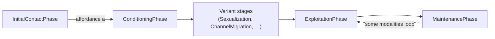
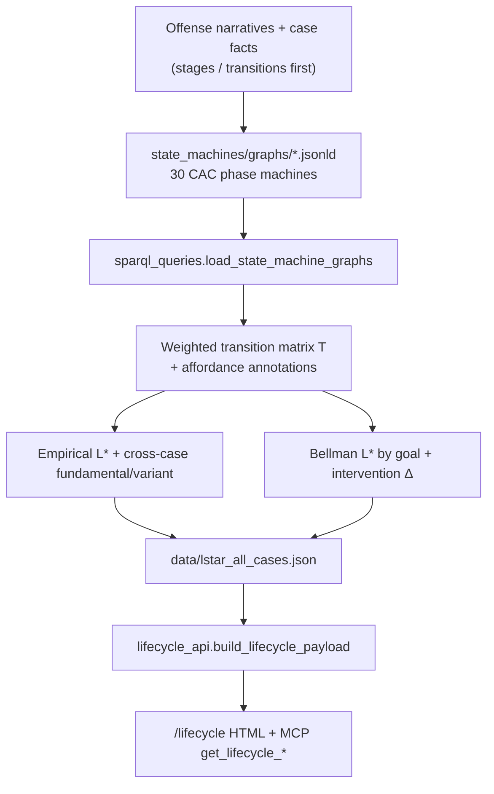

# Exploitation lifecycle state machines

Federal PACER cases modeled as **CAC-native state machines**: typed offense phases, affordance-enabled transitions, and goal-conditioned trajectories $L^{*}_{g,A}$. This directory is the empirical instantiation of Appendix X in [Affordances for Harm](https://doi.org/10.5281/zenodo.21347781) — the machine that turns court-record lifecycles into a transition graph you can query, compare, and intervene on.

The press-release corpus answers *what happened at scale*. These graphs answer *how an offense moved*: which phase followed which, which platform capability enabled the step, and where the path is shared across offense types.

| | |
|---|---|
| Public UI | [`/lifecycle`](https://caselinker.up.railway.app/lifecycle) |
| Lifecycle JSON (trusted / localhost) | `GET /api/lifecycle/cases` |
| Full L\* export (trusted / localhost) | `GET /api/lifecycle/lstar` |
| Public 5-case JSON | `GET /api/lifecycle/anchors` |
| Source PACER material | [`ontology/PACER/`](../ontology/PACER/) (narratives + facts → graphs) |
| Formal construction | AfH Appendix X (tuple $M$ below) |
| Related research Q | [`ontology/q2/`](../ontology/q2/) (exploitation lifecycles) |

The repo README keeps the one-page product summary. This file is the working documentation for the machines.

## What a state machine is here

An **Exploitation State Machine** is an instantiation of a goal-directed offense trajectory, modeled via tuples over CAC ontology classes:

$$
M = (S,\ A,\ T,\ R_{G},\ s_{0},\ F)
$$

| Symbol | In this package |
|---|---|
| $S$ | Typed phase instances (`cac-grooming:InitialContactPhase`, `ConditioningPhase`, `ExploitationPhase`, …) |
| $A$ | Affordance classes on transitions (`Anonymity`, `Ephemerality`, `ContactDiscovery`, …) |
| $T$ | Empirical transition counts $s_{i} \xrightarrow{a} s_{j}$ across case graphs (`cac-core:precedes` + `AffordanceMisuse`) |
| $R_{G}$ | Goal-conditioned rewards — peak state depends on modality (enticement vs sextortion vs enterprise) |
| $s_{0}$ | Always `InitialContactPhase` |
| $F$ | Terminal exploitation / maintenance states for the case |

Each JSON-LD under [`graphs/`](graphs/) is one named investigation: ordered phases via `cac-core:precedes`, optional `caselinker:disruptsChain` markers for sting / chain-break nodes, and `cac-platforms:AffordanceMisuse` annotations that name which capability enabled a transition.



## Corpus: 5 anchors + 25 expansion

| Tier | Count | IDs | Role |
|---|---:|---|---|
| **Anchor** | 5 | `enticement`, `production`, `sextortion`, `enterprise`, `trafficking` | Harm-signature anchors from AfH §5 (Rehman, Pathmanathan, Amin, Bermudez, Riley) |
| **Expansion** | 25 | see `EXPANSION_CASE_IDS` in [`iris.py`](iris.py) | Additional federal PACER instantiations across districts / modalities |

All **30** files are listed in `CASE_FILES` and loaded together for the transition matrix and L\* computation. Metadata (citation, modality, sting flags, corpus id) lives in `CASE_META` in the same module — edit there when adding a case, then drop `{case_id}.jsonld` into `graphs/`.

Anchor vs expansion matters for the UI swimlanes and for “fundamental stage” coverage (computed over the five anchors, then displayed against the full set). Both tiers are first-class inputs to $T$.

## Backbone and intervention

Across the thirty graphs, every complete trajectory passes through the **backbone**:

$$
\mathcal{B} = \{\text{InitialContactPhase},\ \text{ConditioningPhase},\ \text{ExploitationPhase},\ \text{MaintenancePhase}\}
$$

Variant stages (Sexualization, ChannelMigration, ThreatMechanism, CoercionCycle, …) appear only for some goals. That split is the intervention corollary from Appendix X:

- Block a state in $\mathcal{B}$ → degrade $V^{\ast}\_{g}(s\_{0})$ for **every** goal $g$.
- Block a variant (e.g. CoercionCycle) → degrade only the modalities that use it.

[`bellman.py`](bellman.py) implements that as `intervention_delta`: remove a phase type from the reachable graph and recompute Bellman $V^{\ast}$. [`compute_lstar.py`](compute_lstar.py) writes `intervention_at_backbone` into the L\* JSON for the four backbone phases × five goals.

## Two notions of $L^{*}_{g,A}$

| Method | Module | What it optimizes |
|---|---|---|
| **Empirical max-weight path** | [`trajectory.py`](trajectory.py) `max_weight_empirical_path` | Product of cross-case edge frequencies from $s_{0}$ to a terminal type (Viterbi-style). Good for “what the corpus actually walks.” |
| **Bellman $L^{*}$** | [`bellman.py`](bellman.py) `bellman_lstar` | Goal-conditioned optimality (display equation below). Peaks: enticement/production → ExploitationPhase; sextortion → CoercionCycle; enterprise/trafficking → MaintenancePhase. |

Goal-conditioned Bellman update:

$$
V^{\ast}(s) = R_{g}(s) + \gamma \max_{s'} P(s'\mid s) V^{\ast}(s')
$$

Do not conflate them. Empirical $L^{\ast}$ is frequency-weighted path finding. Bellman $L^{\ast}$ is the Appendix X optimality equation with $R_{g}$. Both ship in `data/lstar_all_cases.json`.

## Pipeline



1. **Start from narratives and facts** under [`ontology/PACER/`](../ontology/PACER/) (offense story, stage/transition facts — not the finished graph).
2. **Author** phase graphs in [`graphs/`](graphs/) from those facts (JSON-LD, CAC types, `precedes` chain, optional AffordanceMisuse).
3. **Load** into an rdflib `ConjunctiveGraph` ([`sparql_queries.py`](sparql_queries.py)).
4. **Query** phase order, edge counts, affordance annotations (SPARQL over named graphs `urn:caselinker:case:{id}`).
5. **Compute** [`python3 -m state_machines.compute_lstar`](compute_lstar.py) → [`data/lstar_all_cases.json`](data/lstar_all_cases.json).
6. **Serve** via [`lifecycle_api.py`](lifecycle_api.py) into FastAPI (`run/main.py`) and MCP (`get_lifecycle_cases`, `get_lifecycle_lstar`).

Missing L\* JSON is regenerated on demand the first time the lifecycle API needs it.

## Code map

| Path | Role |
|---|---|
| [`iris.py`](iris.py) | CAC IRIs, anchor/expansion id lists, `CASE_META`, modality helpers |
| [`sparql_queries.py`](sparql_queries.py) | Load graphs; SPARQL for phases, $T$, affordances; ordered `precedes` walks |
| [`trajectory.py`](trajectory.py) | Empirical max-weight path; path weights; fundamental / variant / unique |
| [`bellman.py`](bellman.py) | $R_{g}$, value iteration, Bellman $L^{*}$, intervention corollary |
| [`compute_lstar.py`](compute_lstar.py) | CLI: rebuild full `lstar_all_cases.json` |
| [`lifecycle_api.py`](lifecycle_api.py) | Payload for `/lifecycle` and trusted lifecycle APIs |
| [`graphs/`](graphs/) | 30 case JSON-LD state machines |
| [`data/lstar_all_cases.json`](data/lstar_all_cases.json) | Computed matrix, per-case sequences, global/Bellman L\*, interventions |

## Recompute locally

```bash
# From repo root (uses graphs/ → writes data/lstar_all_cases.json)
python3 -m state_machines.compute_lstar
```

Or import the API builders without regenerating if the JSON already exists:

```python
from state_machines.lifecycle_api import build_lifecycle_payload, load_lstar_raw

payload = build_lifecycle_payload()   # swimlane-ready
raw = load_lstar_raw()                # full compute output
```

Requires `rdflib` (already in root `requirements.txt`). No database access — graphs on disk are the source of truth.

## HTTP and MCP

| Surface | Auth | Returns |
|---|---|---|
| `GET /lifecycle` | Public | HTML; payload embedded server-side |
| `GET /api/lifecycle/anchors` | Public (rate limited) | Five anchor cases only |
| `GET /api/lifecycle/cases` | Trusted `CaseLinker-Key` or localhost | Anchor + expansion swimlane payload |
| `GET /api/lifecycle/lstar` | Trusted / localhost | Raw `lstar_all_cases.json` |
| MCP `get_lifecycle_cases` / `get_lifecycle_lstar` | Same trusted-key gate | See [`caselinker_mcp/README.md`](../caselinker_mcp/README.md) |

## Scope and limits

These machines are theorems over the **observable** enforcement record: detected, charged, public federal matters. Trajectories that never appear in PACER are absent by construction. The graphs also abstract away victim experience and offender psychology — they map capability to phase progression, nothing else. That boundary is intentional (AfH Appendix Y); do not treat $L^{*}$ as a theory of why people offend.

Press-release CASE/UCO graphs under `ontology/graph_output/` are a separate layer (corpus-scale SPARQL). PACER state machines here are a **court-record overlay** for lifecycle and intervention analysis, not a substitute for the 10k+ press-release graphs.

## External references

- [Affordances for Harm (AfH)](https://doi.org/10.5281/zenodo.21347781) — §5 harm signatures, §6.2 contact chain, Appendix X state machine
- [CAC Ontology](https://github.com/Project-VIC-International/CAC-Ontology) — phase and platform modules
- [CASE](https://caseontology.org/) · [UCO](https://unifiedcyberontology.org/) · [Project VIC](https://projectvic.org/)
- Ontology working docs: [`ontology/README.md`](../ontology/README.md)
